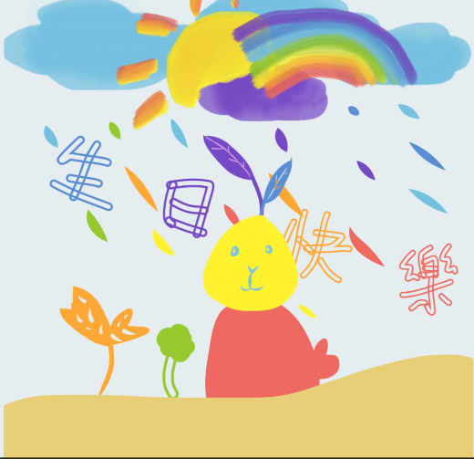
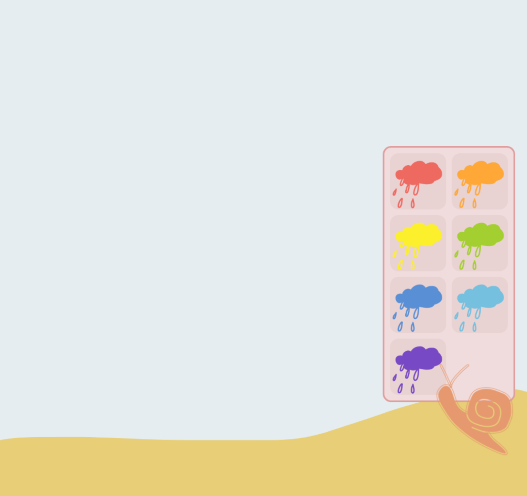
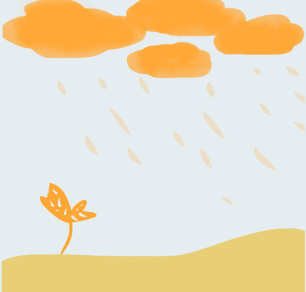

# Music Forest 會唱歌的慶生卡片

 

### [點這裡看網站！](https://ansticefish.github.io/music-forest/#/)
 

## 專案故事

在思考慶生網站時，想到了音符。接著想到，如果能讓音樂與畫面一點一點、有層次地出現應該很有趣！
 
於是便這樣做出了結合「澆水」以及「音樂」的網站。

 

### 使用介紹
 

1. 連續點擊兩下右下角的蝸牛，就會出現選擇面板。

 

 

2. 依照選擇的顏色，會召喚出不同顏色的雲朵。下雨時，土壤中會長出同樣顏色的植物，也能聽到一小段音樂。
  這些音樂會隨著點擊次數增加而變長，最後拼湊出完整的生日快樂歌！

 

 

### 專案技術
這個專案使用Vue2製作而成，主要以資料的變動去帶動畫面的改變、音樂的播放等。 
RWD部分則採用相對單位設定元素的大小、定位，使畫面能隨著螢幕彈性變化。

